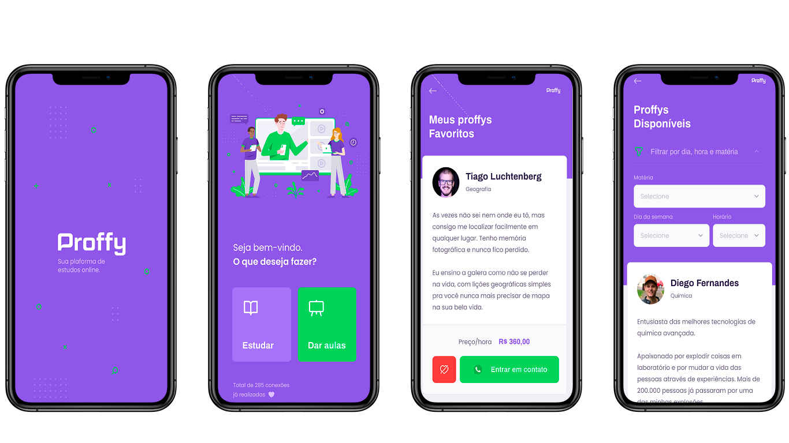

<h1 align="center">
  
</h1>

<h3 align="center">
  Complete web and mobile application to schedule or teach classes. #2 NLW project by @Rocketseat
</h3>

<p align="center">Your online study platform</p>

<p align="center">
  <a href="#%EF%B8%8F-about-the-project">About the project</a>&nbsp;&nbsp;&nbsp;|&nbsp;&nbsp;&nbsp;
  <a href="#-technologies">Technologies</a>&nbsp;&nbsp;&nbsp;|&nbsp;&nbsp;&nbsp;
  <a href="#-getting-started">Getting started</a>&nbsp;&nbsp;&nbsp;|&nbsp;&nbsp;&nbsp;
  <a href="#-how-to-contribute">How to contribute</a>&nbsp;&nbsp;&nbsp;|&nbsp;&nbsp;&nbsp;
  <a href="#-license">License</a>
</p>

## 📖 About the project
<h1 align="center">
  
  
</h1>

An application designed to connect students and teachers. Teachers can set available times and subjects and students can schedule classes and favorite teachers.

## 🚀 Technologies

Technologies that I used to develop this web client

- [Node.js](https://nodejs.org/en/)
- [ReactJS](https://reactjs.org/)
- [React Native](https://reactnative.dev/)
- [TypeScript](https://www.typescriptlang.org/)
- [Expo](https://expo.io/)
- [Express](https://expressjs.com/pt-br/)
- [TypeORM](https://typeorm.io/#/)
- [JWT-token](https://jwt.io/)
- [PostgreSQL](https://www.postgresql.org/)
- [React Router DOM](https://reacttraining.com/react-router/)
- [React Navigation](https://reactnavigation.org/)
- [Husky](https://github.com/typicode/husky)
- [Commitlint](https://github.com/conventional-changelog/commitlint)
- [Eslint](https://eslint.org/)
- [Prettier](https://prettier.io/)
- [EditorConfig](https://editorconfig.org/)

## 💻 Getting started

### Requirements

- [Node.js](https://nodejs.org/en/)
- [Yarn](https://classic.yarnpkg.com/)
- [Expo](https://expo.io/)
- One instance of [PostgreSQL](https://www.postgresql.org/)

> Obs.: I recommend use docker

**Clone the project and access the folder**

```bash
$ git clone https://github.com/bruno07dev/proffy.git && cd proffy
```

**Install dependencies**

```bash
$ yarn
```

**Follow the steps below**

### Backend

```bash
# Create the instance of postgreSQL using docker
docker run --name proffy-postgres -e POSTGRES_USER=docker \
              -e POSTGRES_DB=proffy -e POSTGRES_PASSWORD=docker \
              -p 5432:5432 -d postgres

# Use the script to run the migrations
$ yarn server typeorm:migration:run

# To finish, run the api service
$ yarn server dev:server

# Well done, project is started!
```

### Web

_Obs.: Before to continue, be sure to have the API running_

```bash
# Be sure the file 'packages/web/src/services/api.ts'
# have the IP to your API

# Start the client
$ yarn web start
```

### Mobile

_Obs.: Before to continue, be sure to have the API running_

```bash
# Be sure the file 'packages/mobile/src/services/api.ts'
# have the IP to your API

# Start the expo service and scan the QR code with Expo Client
$ yarn mobile start
```

## 🤔 How to contribute

**Make a fork of this repository**

```bash
# Fork using GitHub official command line
# If you don't have the GitHub CLI, use the web site to do that.

$ gh repo fork bruno07dev/proffy
```

**Follow the steps below**

```bash
# Clone your fork
$ git clone your-fork-url && cd proffy

# Create a branch with your feature
$ git checkout -b my-feature

# Make the commit with your changes
$ git commit -m 'feat: My new feature'

# Send the code to your remote branch
$ git push origin my-feature
```

After your pull request is merged, you can delete your branch

## 📝 License

This project is licensed under the MIT License - see the [LICENSE](LICENSE) file for details.

---

> Status Project: Project finalized :heavy_check_mark:
# 🎬 Desenvolvedores

[ <br> <sub> Bruno Cardoso </sub>](https://www.linkedin.com/in/bruno-s-cardoso/) |
| :---: |

Made with 💜 by Bruno Cardoso 👋
